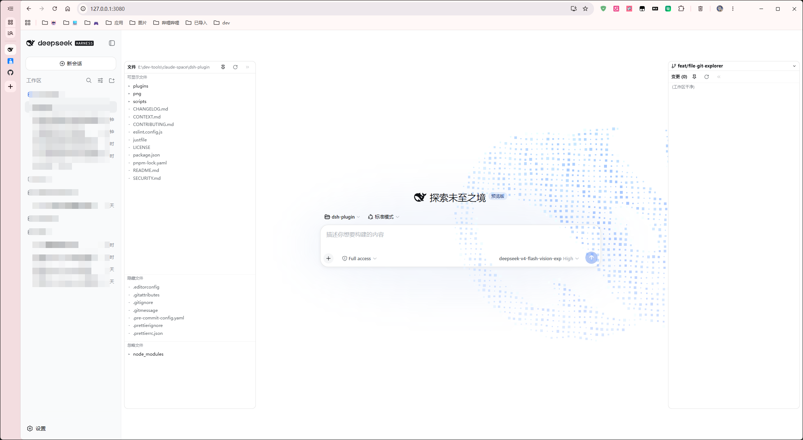
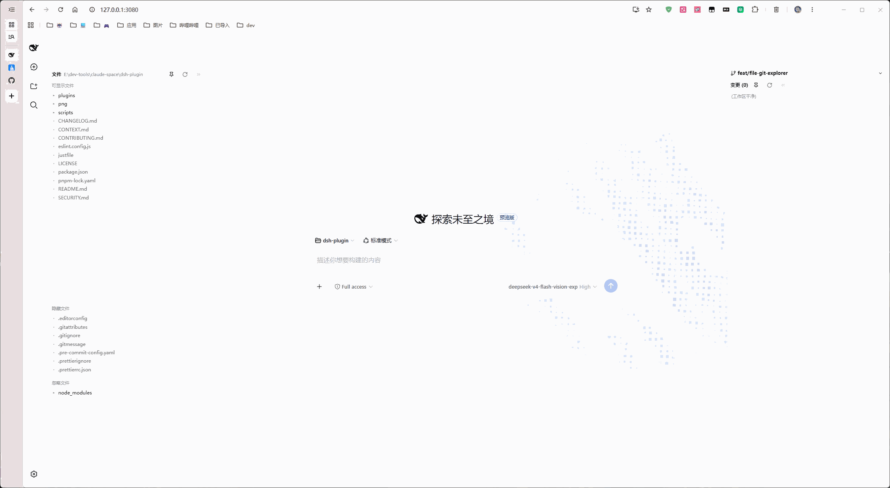
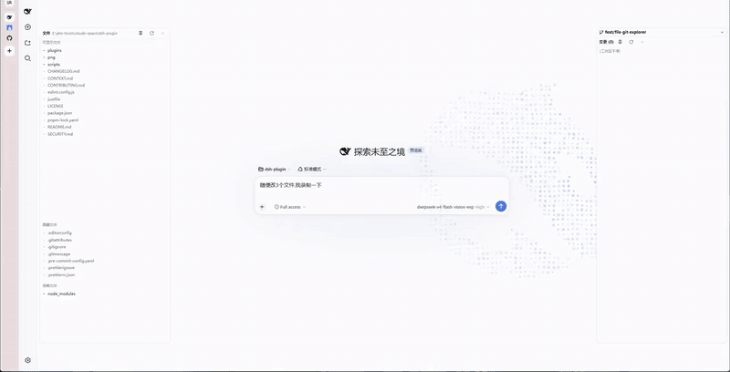

# dsh-plugin

> DeepSeek Harness (DSH) 插件集合 —— 给 DSH 补上余额监控、本地识图、粘贴图片落盘等日常能力,`link:` 本地安装即用,随 `dsh web` 启动自动挂载。

[](LICENSE)
[](package.json)
[](https://github.com/deepseek-ai/DeepSeek-Harness)

## 这是什么

DSH 的插件生态还在早期,本仓库把几个日常高频缺口做成了独立插件,一个插件一个目录,按需取用:

| 插件                | 解决什么问题                             | 一句话说明                                                                                    |
| ------------------- | ---------------------------------------- | --------------------------------------------------------------------------------------------- |
| `ds-balance`        | 官方状态栏看不到余额和用量               | stats 行下方加第二行:余额 + 今日/本月 token,每 5 分钟刷新                                     |
| `tool-vision`       | DeepSeek 模型不支持图片输入              | 本地识图工具,把图片交给本地视觉模型(llama-server / LM Studio / Ollama)描述                    |
| `paste-image`       | 粘贴图片发送会被"当前模型不支持图片"拒绝 | 粘贴瞬间把图片落盘成文件,路径写入草稿,配合 `tool-vision` 实现看图                             |
| `file-git-explorer` | 看不到项目文件和 git 状态                | 左右树浏览:左侧文件树(可见/隐藏/忽略三区, 按名搜索)+ 右侧 git 树(分支/变更/diff/**提交历史**) |
| `db-console`        | GUI 里没有数据库客户端                   | 会话头部「数据库」页签:PG 完整链接登录(按项目保存)、schema 树、SQL 补全高亮、结果网格         |
| `deepseek-harness`  | 想要粒子鲸鱼背景                         | 蓝色粒子鲸鱼(DeepSeek 品牌蓝)默认开启,沿用官方明/暗/系统主题;`?dshtest=1` 隐藏式诊断面板      |
| `batch-archive`     | 会话只能一个个归档                       | 侧边栏底部「批量归档」按钮 + 面板:勾选/全选多个会话一键归档(两次点击确认)                     |

> `tool-vision` + `paste-image` 合起来的效果:你在输入框粘贴一张截图,agent 就能"看到"并描述它——完全绕开 DeepSeek 模型的图片输入限制。

## 效果展示

### 主界面(Home 页面)





## 快速上手

前置:Node.js >= 20、已安装 DeepSeek Harness(`dsh` CLI)及 `web` profile。

### 1. 克隆并安装两个 UI 插件

```sh
git clone https://github.com/eh-tools/dsh-plugin.git
cd dsh-plugin

# <repo-abs-path> 换成你克隆下来的仓库绝对路径(link: 安装要求绝对路径)
dsh plugin --profile web add link:<repo-abs-path>/plugins/ds-balance
dsh plugin --profile web add link:<repo-abs-path>/plugins/paste-image
dsh plugin --profile web add link:<repo-abs-path>/plugins/file-git-explorer
dsh plugin --profile web add link:<repo-abs-path>/plugins/deepseek-harness
dsh plugin --profile web add link:<repo-abs-path>/plugins/batch-archive
```

装完**重启 DSH 并硬刷新浏览器**(Cmd/Ctrl+Shift+R)生效。

### 2. 挂载 tool-vision

纯 host 插件不走 plugin 命令,把下面这段加进目标 preset 的 `agent.cordis.yml`(如
`~/.dsh/.agent-presets/<id>/agent.cordis.yml`),保存后新建会话生效:

```yaml
- id: tool-vision
  name: <repo-abs-path>/plugins/tool-vision/lib/index.js
  config:
    baseUrl: http://127.0.0.1:8080/v1
```

> 更新插件:`git pull` 后重跑同一条安装命令;只改 `lib/client.js` 时刷新浏览器即可,
> 改 `lib/index.js` 才需要重启 DSH。
> 卸载:`dsh plugin --profile web remove dsh-ds-balance` / `dsh-paste-image`,然后重启 DSH。

## 插件使用说明

### ds-balance —— 余额/调用量状态栏

装好后,官方 stats 行**下方**出现独立第二行:

```
DeepSeek ¥68.64 | 今日 34K tok | 本月 1.2M tok
```

- 每 5 分钟自动刷新;悬停可看明细(总余额 / 赠送 / 充值 / 今日与本月输入输出 token 拆分)。
- 配置:凭证写入 `~/.dsh/.credentials.yaml`(或环境变量),经 credentials 服务读取,不进代码:

  ```yaml
  DEEPSEEK_API_KEY: sk-xxxx
  DEEPSEEK_USER_TOKEN: <平台网页登录态 token>
  ```

  `DEEPSEEK_USER_TOKEN` 的获取:登录 platform.deepseek.com 后,F12 → Application →
  Local Storage → 复制 `userToken` 键 JSON 值里的 `.value` 字段;也可以在状态栏上点
  **"浏览器登录"**,插件会用系统 Chrome 打开登录页,登录后自动写入并生效。

#### 常见问题

| 现象                                | 原因                                                                    | 解决                                                                                          |
| ----------------------------------- | ----------------------------------------------------------------------- | --------------------------------------------------------------------------------------------- |
| 状态栏没有第二行                    | base URL 指向非官方 API(网关/代理/自建中转),或未配置 `DEEPSEEK_API_KEY` | 确认 base 是 `api.deepseek.com` 且 key 已配置;**非官方场景整行隐藏是设计行为**,不会污染状态栏 |
| 只有余额,没有今日/本月              | 未配置 `DEEPSEEK_USER_TOKEN`                                            | 点状态栏"浏览器登录",或手动复制 userToken                                                     |
| 调用量突然消失,日志报 `40002/40003` | userToken 过期/退出登录                                                 | 重新登录,重新复制/一键登录                                                                    |
| "浏览器登录"失败                    | 本机没有 Google Chrome                                                  | 装 Chrome,或 `npx playwright install chromium`                                                |
| 数字不更新                          | 5 分钟轮询 + 60s 服务端缓存                                             | 正常现象,等下一轮刷新;改了 key 后重启 DSH 最稳                                                |

> 注意:调用量接口是平台用量页的**私有接口**(无公开文档),只返回 token 数不返回
> 调用次数,且可能随时变动——这属于平台侧限制,插件无法控制。

### tool-vision —— 本地识图工具

把图片路径交给它,返回视觉模型对图片的描述(读图 / OCR / 版面理解)。工具名 `vision`,
agent 会自动调用;支持 PNG / JPEG / WebP / BMP / GIF。

两种用法(核心配置 `autoStart`):

- **常驻服务**(高频):自己起一个 llama-server,`autoStart` 保持 `false`(默认),插件只对接端口。
- **on-demand**(低频 / 省内存):配 `autoStart: true`,插件在调用时自动拉起服务、
  用完即退(`keepAliveMs: 0`),外部已有服务时优先复用,不重复拉起。

完整配置项(全部有默认值,除 `baseUrl` 外通常不用改):

| 键                                          | 默认值                         | 说明                                                                          |
| ------------------------------------------- | ------------------------------ | ----------------------------------------------------------------------------- |
| `baseUrl`                                   | `http://127.0.0.1:8080/v1`     | 任意 OpenAI 兼容视觉服务的 API 地址(带 `/v1`),本地或云端都行                  |
| `model`                                     | `''`                           | 模型 id;留空自动探测 `/v1/models` 第一个                                      |
| `apiKey`                                    | `''`                           | **云服务认证**:直接填 `sk-xxx`,或 `env:MY_KEY` 读环境变量;留空 = 无认证(本地) |
| `defaultPrompt`                             | `用中文简要描述这张图片的内容` | 调用方未传 `prompt` 时的指令                                                  |
| `maxTokens` / `timeoutMs` / `maxImageBytes` | `1024` / `120000` / `30 MiB`   | 生成上限 / 超时 / 图片体积上限                                                |
| `autoStart`                                 | `false`                        | 服务不可达时自动拉起 llama-server(云端保持 `false`)                           |
| `serverCommand`                             | `''`                           | 拉起命令;留空用默认(基于 `baseUrl` 推导,已适配 Windows)                       |
| `keepAliveMs`                               | `0`                            | `0` = 用完即退;`>0` = 闲置 N 毫秒后退出                                       |

#### 常见问题

| 现象                            | 原因                                        | 解决                                                                                                    |
| ------------------------------- | ------------------------------------------- | ------------------------------------------------------------------------------------------------------- |
| 调用 `vision` 超时/报错         | llama-server 没起,或端口与 `baseUrl` 不一致 | 手动起服务;或配 `autoStart: true` 让插件自动拉起                                                        |
| Windows 上找不到 `llama-server` | 不在 `PATH`,或 cmd 不展开 `~`               | 显式配 `serverCommand` 完整路径(示例见插件 README);更省事用 LM Studio / Ollama,完全不碰 `serverCommand` |
| 想换模型 / 换推理服务           | —                                           | 只改 `baseUrl` + `model`,LM Studio / Ollama / vLLM 都行,只要模型支持视觉                                |
| 想用**云端**视觉模型            | —                                           | `baseUrl` 填云服务地址 + `model` 填云端模型 id + `apiKey` 填 key(`env:` 引用环境变量),示例见插件 README |
| 云端返回 401/403                | key 不对,或服务不支持视觉模型               | 核对 `apiKey` 与模型 id;DeepSeek 官方 API 不支持图片,不能当 vision 后端                                 |
| 图片太大被拒                    | 默认上限 30 MiB                             | 调大 `maxImageBytes`,或先压缩图片                                                                       |
| 多轮讨论模型"不记得"之前的图    | 每次调用是独立请求,无会话记忆               | 这是服务侧限制,由 agent 自己带上下文                                                                    |
| 常驻服务太占内存                | 模型常驻内存                                | `autoStart: true` + `keepAliveMs: 0`,用完即退                                                           |

### paste-image —— 粘贴图片落盘

在输入框 **Cmd+V / Ctrl+V** 粘贴图片时,自动把图片字节保存到**当前会话工作目录的
`attachments/`**,并把绝对路径追加进草稿,形如:

```
[已粘贴图片: /path/to/session/attachments/1760000000000-shot.png]
```

这样 agent 看到路径后,直接用 `tool-vision` 传该路径识别——绕开 DSH 主模型
(DeepSeek)不支持图片的检查。限制:PNG / JPEG / WebP / GIF,单张 ≤ 30MB;
文本粘贴不受影响。

### file-git-explorer —— 左右树浏览

左侧**文件树** + 右侧 **git 树**,夹在会话 header 与 composer 之间,可拉伸、
可收起为细条、图钉锁定,不覆盖主对话区:

- **左树三区**:可显示文件(排除 dot 与 .gitignore)/ 隐藏文件(dot 开头)/ 忽略文件(.gitignore 忽略项 + 通向深层忽略项的桥接目录),根始终 = DSH 进程 cwd,逐级懒加载;点文件 → 内容悬浮面板(向右浮出,可越对话区),同时联动右树——有 diff 则定位高亮,不自动打开。
- **文件搜索**:左树头部放大镜展开输入框,按名/相对路径即时检索(不搜内容),结果平铺带 显/隐/忽 分区徽标;点文件直接打开预览,点目录在树内 reveal 定位。
- **右树**:当前分支(只读下拉,本地/远程分组,不支持切换)+ 变更列表(相对 HEAD,含暂存/未暂存/未跟踪,状态徽标);点变更 → diff 悬浮面板(向左浮出)。
- **提交历史**:右树头部时钟按钮浮出历史面板(与 diff 浮层互斥),跟随历史面板头部按钮点选的「查看分支」(默认当前分支);50 条/页滚动加载,点提交看说明 + 文件 ±行数,再点文件看该次 diff。
- **图钉 📌**:钉住后两面板都不能收起;未钉时点面板外自动收起为细条。
- **侧栏联动(页签感知)**:切到轨迹/数据库等非对话页签时,两树自动收成细条
  (悬停细条仍可展开, 方便从文件里复制连接地址);切回对话恢复进入前的
  固定/开合状态。鼠标在「侧栏 + 其悬浮栏」任一区域内移动都不会误收,
  全部离开才延迟收起。
- 面板宽度 / 开合 / 「查看中」分支按仓库根缓存,切回自动恢复。

详见 `plugins/file-git-explorer/README.md`。

**左右树演示:**



### db-console —— 数据库控制台

会话头部新增第三个页签「数据库」(排在轨迹之后),粘贴完整 PostgreSQL 链接串即可登录:

- **按项目单例**:链接以仓库根为键保存在本机 `~/.dsh/storages/db-console.json`
  (明文, 权限 0600, UI 打码展示;安全口径见 `docs/adr/0001`), 切工作区、刷新浏览器、
  重启 DSH 都不丢——每个项目连自己的库。
- **schema 树**:连接成功后内省表结构(schema → 表 → 列, 手动 ⟳ 刷新),
  点表名直接插入编辑器。
- **SQL 编辑器**:语法高亮 + 三级补全(SQL 关键字 / 表名 / 输入 `表名.` 出列),
  `Ctrl/Cmd+Enter` 执行。
- **结果网格**:多语句分段渲染;行集默认截断 500 行并提示取回总数;点单元格复制;
  写语句显示影响行数。执行不做任何拦截。
- 依赖 `pg` 驱动,首次安装后在本插件目录执行过 `pnpm install`(仓库克隆后装一次即可)。

### batch-archive —— 批量归档

侧边栏底部(设置按钮旁)新增「批量归档」按钮,打开面板勾选多个会话一键归档:

- **入口**:展开侧边栏显示「图标 + 批量归档」,收起为窄栏时只显示图标。
- **面板**:按工作区分组列出所有未归档会话(无归属的归「未分组」),每行显示标题、
  相对时间与运行中状态点;支持全选 / 单选。
- **归档**:「归档所选 (N)」→ 按钮变为「确认归档 (N)？」再次点击即逐个归档
  (走客户端 `workspaces.archiveSession`,与行内归档同一接口);已归档会话自动从列表
  隐藏,会话日志保留。防误触:二次确认 + 归档中锁定界面。
- 纯客户端实现(无 Host 逻辑),会话数据来自槽位标准 props,不落盘任何状态。

## 常见问题速查

| 现象           | 解决                                                                         |
| -------------- | ---------------------------------------------------------------------------- |
| 装了插件没效果 | 重启 DSH + 硬刷新浏览器(Cmd/Ctrl+Shift+R);确认安装命令用的是仓库**绝对路径** |
| 改了代码不生效 | `lib/client.js` 改动刷新浏览器即可;`lib/index.js` 改动需重启 DSH             |
| 如何更新插件   | `git pull` 后重跑安装命令                                                    |
| 如何卸载       | `dsh plugin --profile web remove <插件id>`,然后重启 DSH                      |
| 凭证放哪       | `~/.dsh/.credentials.yaml`(或环境变量),**不要写进代码/提交到 git**           |
| 想自己写插件   | 见下方「贡献与开发」                                                         |

## 贡献与开发

开发/新增插件/提交规范等见 [CONTRIBUTING.md](CONTRIBUTING.md);仓库结构很简单:
`plugins/<plugin-id>/` 一个插件一个目录(需要浏览器 UI 的为静态双半包,
纯功能性的为纯 host 插件,写法都有现成参考)。

## 安全

发现漏洞请走私有渠道报告,勿开公开 Issue,详见 [SECURITY.md](SECURITY.md)。

## 关于

- **开发方式**:本仓库由 **DeepSeek** 模型协助、基于 **DeepSeek Harness (DSH)**
  工具链开发。
- **免责声明**:第三方社区项目,与 DeepSeek / 深度求索官方无隶属关系,未经官方认可
  或背书;`ds-balance` 的调用量接口为平台私有接口,可能随时变动,仅用于展示你本人
  账户信息。

## 协议

[MIT](LICENSE) © 2025 [eh-tools](https://github.com/eh-tools)
