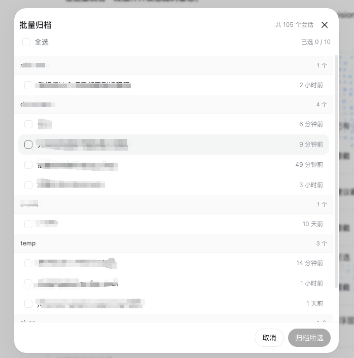

# dsh-batch-archive —— 批量归档插件

侧边栏底部(设置按钮旁)新增「批量归档」按钮,点击打开居中面板,勾选多个会话一键归档。



## 功能

- **入口**:`sidebar.footer.action` 槽位 —— 展开侧边栏显示「图标 + 批量归档」,收起为窄栏(rail)时只显示图标。
- **面板**:`shell.overlay` 槽位 —— 居中模态,按工作区分组列出所有**未归档**会话(无归属的归「未分组」),每行:复选框 + 标题 + 相对时间 + 运行中状态点。
- **批量归档**:全选/单选 →「归档所选 (N)」→ 按钮变为「确认归档 (N)」再次点击即逐个调用客户端 `workspaces.archiveSession(id)` 归档;成功提示「已归档 N 个会话」,已归档会话自动从列表消失(归档后从分组列表隐藏,会话日志保留)。
- **防误触**:二次确认 + 归档中锁定界面 + 失败提示。

## 数据与动作

纯客户端实现,无 Host 逻辑:

- 会话列表 / 归档状态来自两个槽位的标准 props:`useSessions`(byId/displayTitle/updatedAt/running)与 `useWorkspaces`(items/archivedSessionIds)。
- 归档动作直接调用客户端 `workspaces` 服务的 `archiveSession(sessionId)` —— 与产品自带的行内归档同一接口。

## 安装

```sh
dsh plugin --profile web add link:<本仓库绝对路径>/plugins/batch-archive
```

装完**重启 DSH 并硬刷新浏览器**(Cmd/Ctrl+Shift+R)生效。

> 更新:只改 `lib/client.js` 刷新浏览器即可;改 `lib/index.js` 才需要重启 DSH。
> 卸载:`dsh plugin --profile web remove dsh-batch-archive`,然后重启 DSH。

## 文件

| 文件               | 说明                                               |
| ------------------ | -------------------------------------------------- |
| `lib/client.js`    | 浏览器半:按钮 + 归档面板(React,`require('react')`) |
| `lib/index.js`     | Host 半:no-op,仅维持 bundle 挂载行                 |
| `cordis.patch.yml` | bundle patch:插入 `batch-archive` 挂载行           |
| `manifest.json`    | 仓库内插件清单                                     |
