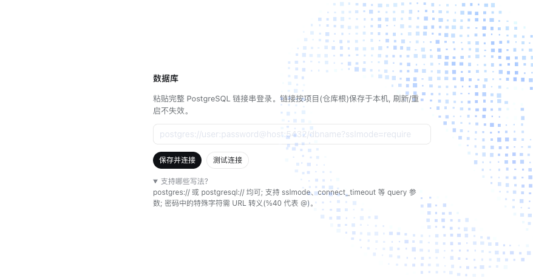
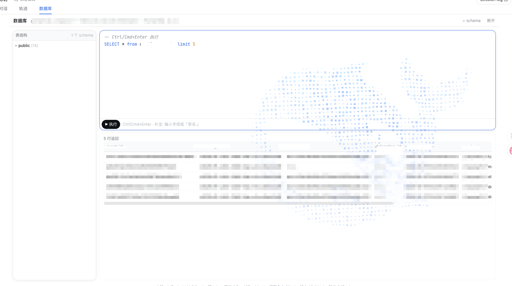

# dsh-db-console

会话头部新增「数据库」页签(排在轨迹之后):粘贴完整 PostgreSQL 链接串即可登录,
在 GUI 里浏览 schema、写 SQL(三级补全 + 高亮)、看结果网格。





## 安装

```sh
# <repo-abs-path> 换成仓库绝对路径(link: 安装要求绝对路径)
dsh plugin --profile web add link:<repo-abs-path>/plugins/db-console
pnpm install   # 在本插件目录执行一次, 拉取 pg 驱动
```

装完重启 DSH 并硬刷新浏览器(Cmd/Ctrl+Shift+R)生效。

## 特性

- **按项目单例**:隔离键 = 仓库根(从会话 cwd 向上找第一个 `.git`,无则退化 cwd),
  一个项目至多一条连接,切工作区即切换到那个项目的库。
- **凭据持久化**:完整链接串明文存 `~/.dsh/storages/db-console.json`
  (原子写,文件权限 0600;UI 一律打码展示)。刷新浏览器、清缓存、重启 DSH 均不失效。
  安全口径(为何明文、为何不拦截)见仓库 `docs/adr/0001`。
- **schema 树**:连接成功后内省 information_schema(public schema 置顶),
  手动 ⟳ 刷新;点表名插入编辑器。
- **SQL 编辑器**:关键字/字符串/数字/注释高亮 underlay + 三级补全
  (SQL 关键字 / 表名 / `表名.` 出列名,FROM/JOIN 别名可识别);
  `Ctrl/Cmd+Enter` 或 ▶ 执行。
- **结果网格**:多语句分段渲染;行集截断 500 行并提示实际取回总数;
  点单元格复制;命令类语句显示影响行数。**执行不做任何拦截**——写库/DROP 都会
  真实下发,请自担风险。

## API(host 半, 回环 only)

`POST /dbc/api/<method>`,需 `x-dsh-plugin: 1` 头,业务错误返回 200 `{ok:false,error}`:

| method          | 入参           | 说明                       |
| --------------- | -------------- | -------------------------- |
| `config.get`    | `{root?}`      | 项目连接配置(含明文 url)   |
| `config.save`   | `{root?, url}` | 校验并保存(覆盖单例)       |
| `config.delete` | `{root?}`      | 删除并断开                 |
| `test`          | `{url}`        | 临时试连,不落盘            |
| `connect`       | `{root?}`      | 用已存配置建池 ping        |
| `disconnect`    | `{root?}`      | 关闭连接池                 |
| `schema`        | `{root?}`      | 内省整树                   |
| `query`         | `{root?, sql}` | 原样执行,行集截断 500 返回 |

## 测试

```sh
node tests/pg.test.mjs   # 纯函数单测(链接校验/打码/形态判别/整树/截断/仓库根)
node tests/smoke.mjs     # 路由层冒烟(DSH_HOME 重定向到临时目录, 无真实 PG)
```
